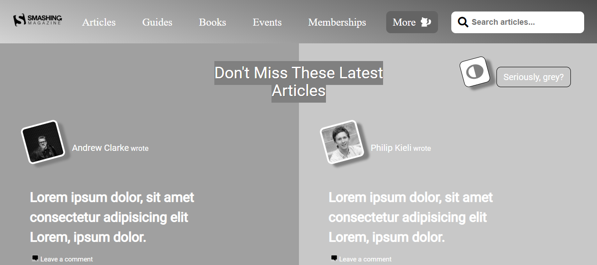

# Design-Teardown-Project
This is a collaborative project which has the objective of building a heatmap of the Smashing magazine website, completed based on the requirement to complete Microverse program/course titled "HTML and CSS",

This project consists of building a webpage using:
Visual hierarchy.
Typography.
Design principles.

## Built With

- HTML
- CSS3

## Live Demo

[Live Demo Link](https://raw.githack.com/abouhid/Design-Teardown-Project/feature-branch/index.html)

## Getting Started

**This is an example of how you may give instructions on setting up your project locally.**
**Modify this file to match your project, remove sections that don't apply. For example: delete the testing section if the currect project doesn't require testing.**

To get a local copy up and running follow these simple example steps.

### Prerequisites

- Browser (Google Chrome, Mozilla Firefox, Safari or any other browser)

### Setup

- Download or clone the repository's files
- Open the index.html file using any web browser of your choice

## Authors

👤 Alexandre Bouhid

- Github: [@abouhid](https://github.com/abouhid)
- LinkedIn: [Alexandre Bouhid](https://www.linkedin.com/in/alexandrebouhid/)

👤 Zulma Rocio

- Github: [@Rocio01](https://github.com/Rocio01)
- Twitter: [@rugiada8801](https://twitter.com/rugiada8801)
- Linkedin: [zulma-martinez-5247a31a8](https://www.linkedin.com/in/zulma-martinez-5247a31a8/)

## 🤝 Contributing

Contributions, issues and feature requests are welcome!

Feel free to check the [issues page](https://github.com/abouhid/Design-Teardown-Project/issues)

## Show your support

Give a ⭐️ if you like this project!

## Acknowledgments

- Microverse
- GitHub
- TheOdinProject

## 📝 License

This project is open licensed.
